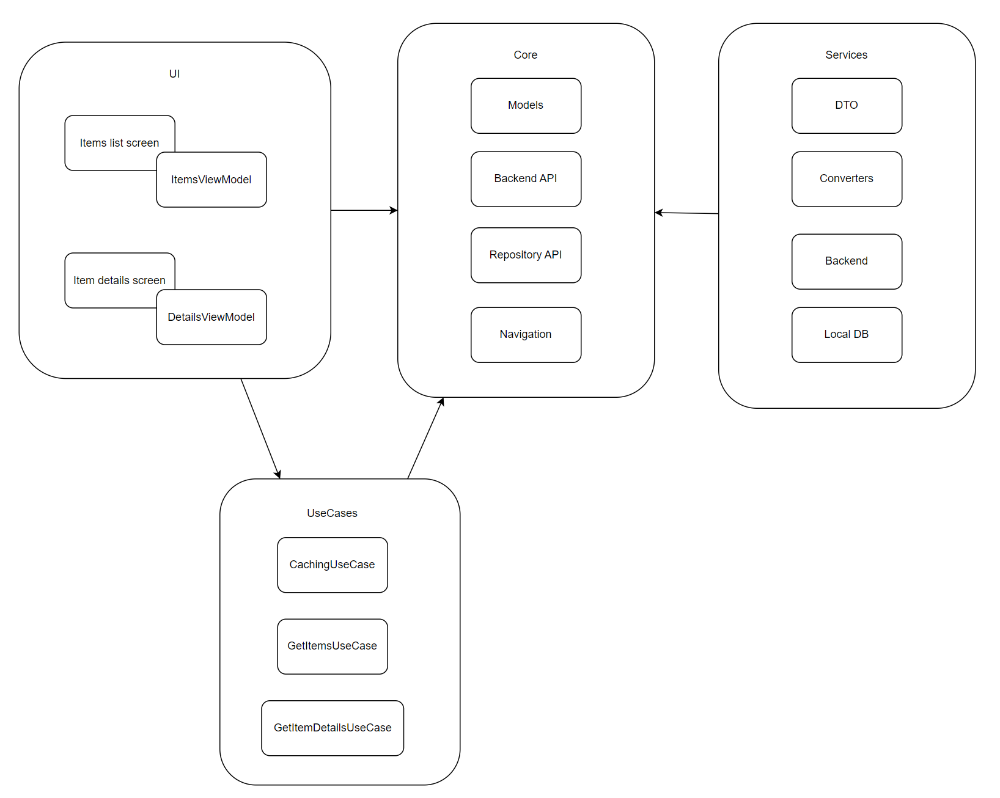

# Структура проекта

**Важное примечание:** Очевидно, что для выполнения задания можно было обойтись без разбивки проекта на модули и определить все классы в рамках одного (главного) модуля. Но я исходил из предположения, что это структура делается под большой проект, который предполагает дальнейшее развитие, поэтому выполнил разбивку на модули в соответствии со следующей архитектурной схемой.

## Схема

## Описание модулей

* **:app** Главный модуль. Не содержит логики. Задает UI-тему, определяет навигацию и определяет DI-зависимости.
* **:core** Ядро. Определяет модели бизнес-логики и интерфейсы взаимодействия между слоями.
  * **:core:domain** Модели бизнес-логики.
  * **:core:backend** Интерфейсы взаимодействия с сервисами бэкенда. В реальной системе такой модуль может быть не один общий на весь бэкенд, а по одному модулю на каждый сервис бэкенда.
  * **:core:repository** Интерфейсы работы с локальными хранилищами данных.
  * **:core:ui** Темы, цвета, шрифты и прочее необходимое для UI.
  * **:core:navigation** Как показывает практика, в реальных больших проектах не обойтись без своей реализации навигации (или обертки над сторонней библиотекой навигации), поэтому выделил в отдельный модуль.
  * **:core:utils** Разные вспомогательные вещи. В текущей реализации здесь определены только диспетчеры. Диспетчеры инжектятся через DI для облегчения написания юнит-тестов.
* **usecases** Бизнес-логика. В данном примере содержит юзкейсы получения данных от бэкенда, кэширования данных в локальном хранилище и получения данных из локального хранилища.
* **:services** Конкретные реализации интерфейсов для работы с бэкендом и локальным хранилищем. Сейчас здесь только заглушки, но в дальнейшем, при реализации сюда буду добавлены DTO и конвертеры DTO <-> модели.
* **:features** UI нашего приложения. Каждый экран приложения лежит в отдельном модуле, что позволит нам добавлять новые экраны в приложение не трогая уже работающий UI.
  * **:feature:items** Экран со списком объектов.
  * **:feature:details** Экран с детальной информацией о выбранном объекте.